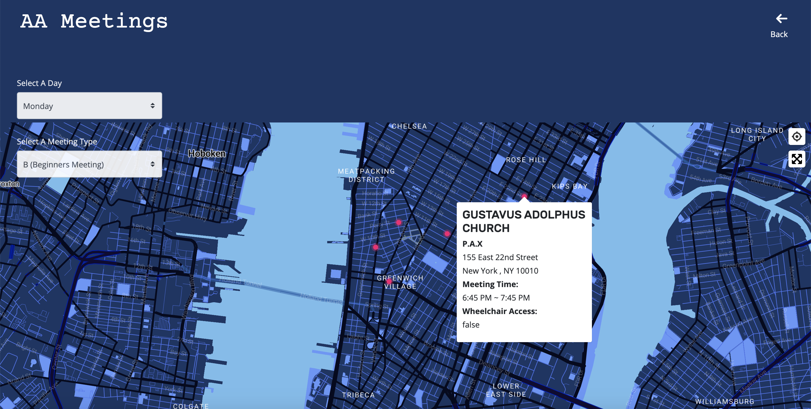

## Final Assignment 1 ( AA Meeting Finder )
This project aggregates weekly assignment [1](https://github.com/Xingwei726/data-structures/tree/master/week1), [2](https://github.com/Xingwei726/data-structures/tree/master/week2), [3](https://github.com/Xingwei726/data-structures/tree/master/week3), [4](https://github.com/Xingwei726/data-structures/tree/master/week4), [6](https://github.com/Xingwei726/data-structures/tree/master/week6), [7](https://github.com/Xingwei726/data-structures/tree/master/week7), [10](https://github.com/Xingwei726/data-structures/tree/master/week10), and [11](https://github.com/Xingwei726/data-structures/tree/master/week11). Meeting data was parsed, cleaned and stored in the PostgreSQL. Then I used [Mapbox](https://www.mapbox.com/) to display relevant meetings as map markers with popups that show all relevant information about the AA meeting in Manhattan.

## Working Process

**Part One: Parsing Data**

 - All data of AA Meetings were manually parsed and cleaned. In Weekly
   Assignment 2 , I used following code to target on the address
   details:

```javascript
$('td').each(function(i, ele) {
    if($(ele).attr("style")==='border-bottom:1px solid #e3e3e3; width:260px'){
        meetingAddress+=$(ele).text().trim('')+"\n"
    };
});
```

 - It worked in previous scenario when I was trying to target on that
   only element, however it didn't work for parsing out all the
   information. Therefore I reexamined the structure and found out that
   each location object is wrapped by a `<tr>` tag nested inside another
   two `<tr>` tag , and inside each location object, address details is
   wrapper by a pair of  `<td>` tag as well as the meetings information
   ( which is wrapped by another pair of  `<td>` tags). So I use the
   following code to target on that:

```javascript
$('tr tr tr').each(function (i, elem) {
  //location + meeting information
}
```

 - This returns all text element inside `'tr tr tr'`, my logic was that:
   find first `<td>`tag inside the text element--->it contains four
   lines of texts ( eg. "Harlem Children's Zone Admin. Offices", "125 -
   TWO FOR ONE -", "35 East 125 Street, 1st Floor Conference Room" , "(@
   Madison Avenue) 10035")--->then using regular expressions and
   `.split` to split a string into an array of substrings---then use
   `.filter(Boolean)` to remove values which are "falsey", like empty
   strings or null--->the first element in the result array is location
   name ( eg. "Harlem Children's Zone Admin. Offices")

```javascript
// LOCATION DETAILS
var location = $(elem).find('td').eq(0).text().split(/\n|,|\(|\)|-/).map(item => item.trim()).filter(Boolean);
// LOCATION NAMES
var locationName = location[0];
``` 

 - Same with zipcode, it's nested inside the first `<td>` tags, then I
   used `.split('<br>')` to break the string whenever there is a `<br>`
   tag, it's after 3rd `<br>` so I used `[3]` to target on it, after
   trim all white space, last 5 characters is zipcode.
 - *For more details please visit [here](https://github.com/Xingwei726/data-structures/tree/master/week7)*

 
 
 
 **Part Two: Database**


- My initial plan was to create three tables in order to separate location info, group info and meeting info, then join the sub-queries from each one whenever a request has been passed from the front-end user interface. 
- Then as I was testing different queries at week 10, I thought about normalized data may cause queries to slow down and in terms of the amount of data, it's not an overload to query all at once. So I dropped my old table and made a new one  instead:

```javascript
var thisQuery = `CREATE TABLE aameetings (
                                          locationID serial primary key,
                                          locationTitle varchar(200),
                                          streetInfo varchar(200),
                                          city varchar(25),
                                          state varchar(25),
                                          zip varchar(25),
                                          details varchar(200),
                                          wheelchair BOOL,
                                          zone smallint,
                                          latitude double precision,
                                          longitude double precision,
                                          meetingName varchar(200),
                                          meetingDay varchar(25),
                                          TimeStart varchar(25),
                                          TimeEnd varchar(25),
                                          meetingType varchar(25));`;  
```

 - Using async function to inset data into the database:

```javascript
async.eachSeries(addressesForDb, function (value1, callback1) {
    async.eachSeries(value1.meetings, function (value2, callback2) {

        const client = new Client(db_credentials);
        client.connect();

            var thisQuery = "INSERT INTO aameetings (locationTitle, streetInfo, city, state, zip, details, wheelchair, zone, latitude, longitude, meetingName, meetingDay, TimeStart, TimeEnd, meetingType) VALUES (E'" + value1.locationTitle + "','" + value1.streetInfo + "', '" + value1.city + "', '" + value1.state + "', '"+ value1.zip + "', '" + value1.details + "', '" + value1.wheelchair + "', '" + value1.zone + "', '" + value1.geocode.latitude + "', '"+value1.geocode.longitude + "','" + value2.meetingName + "','" + value2.day + "', '" + value2.start + "', '" + value2.end + "', '"+ value2.type + "');";

                client.query(thisQuery, (err, res) => {
                    console.log(err, res);
                    client.end();
                });
                setTimeout(callback2, 2000);
        });
        setTimeout(callback1,2000);
}); 

```
 - *For more details please visit [here](https://github.com/Xingwei726/data-structures/blob/master/week7/week7_insertData.js)*


 
  
**Part Three: Visual Design**


Two main filters I considered to use here are by **'Day of the Week'** and **'Meeting Type'** because I thought about my users might want to find a meeting that fit his / her needs, for example he or she might want to locate a Tuesday meeting that's open for beginners, then all they need to do is to select 'Tuesday' under the day filter and select 'B' in meeting type list. Then dots on the map will be filtered based on the selections.

When users land on the homepage, it will make a query to the database of the default setting. Then after users make filter decisions, it will make a query that based on the filters and return will all the location & meeting information that fit to the keys.

  
**Part Four: Query Design**
The app uses [handlebars](https://handlebarsjs.com/) and npm [express](https://www.npmjs.com/package/express)  to send data to the webpage. Values of Day and Type filter from front-end interface will be passed into the SQL query. SELECT statement sets latitude, longitude, locationTitle as unique parameters and then creates a JSON object for the detail information. 

```javascript
function dayFilter(day, type){
  return new Promise(resolve => {
      // var now = moment.tz(Date.now(), "America/New_York"); 
      var dayy = day || moment().format("dddd") + 's'; 
      var typee = type;
      console.log(day)
      var output = {};
     
      const db_credentials = new Object({
        user: "huanx429",
        password: process.env.AWSRDS_PW,
        host: process.env.AWSRDS_EP,
        database: "aa",
        port: 5432,
      });
      
      const client = new Client(db_credentials);
      client.connect();
      
      var thisQuery = `SELECT latitude, longitude, locationTitle, json_agg(json_build_object('location', locationTitle, 'address', streetInfo,'details',details, 'zipcode', zip, 'state', state,'city', city, 'meeting', meetingName, 'day', meetingDay,'shour', TimeStart,'ehour', TimeEnd, 'types', meetingType, 'wheelchair', wheelchair)) as meeting
      FROM aameetings
      WHERE meetingDay = '` + dayy + `' AND meetingType = '` + typee + `'
      GROUP BY locationTitle, latitude, longitude
      ;`;

      client.query(thisQuery, async (err, res) => {
        if (err){console.log(err)}
            console.log(res)
              await fs.readFile('./aahandle.html', 'utf8', (error, data) => {
                var template = handlebars.compile(data);
                output.meetings = res.rows;
                var html = template(output);
                resolve([html,res.rows]);
              });
            client.end();
      });
    });
 }

```


**Part Five: Font-end Connection**

 - Using mapbox to set up the base-map layer

```javascript
var map = new mapboxgl.Map({
    container: 'map',
    // style: 'mapbox://styles/huanx429/ck335276635b81cmv622fh78g',
    style: 'mapbox://styles/huanx429/ck3lupgw3304x1cltlu35yhmp',
    center: [-74.00208589965371,40.723624676777405], // starting position [lng,lat]
    zoom: 13 // starting zoom
});
```

 - Then pass the data to the pop-up contents
```javascript
var popup = new mapboxgl.Popup()
                        .setHTML (
                        "<h3>"+ data[1][i]['meeting'][0]['location']+"</h3>"+
                        "<h4>"+ data[1][i]['meeting'][0]['meeting']+"</h4>"+
                        "<h5>"+ data[1][i]['meeting'][0]['address']+"</h5>"+
                        "<h5>"+ data[1][i]['meeting'][0]['city']+ " , " + data[1][i]['meeting'][0]['state']+ "  " +data[1][i]['meeting'][0]['zipcode']+"</h5>"+
                        "<h4>Meeting Time:</h4>"+
                        "<h5>"+ data[1][i]['meeting'][0]['shour']+" ~ "+data[1][i]['meeting'][0]['ehour']+"</h5>"+
                        "<h4>Wheelchair Access:</h4>"+
                        "<h5>"+ data[1][i]['meeting'][0]['wheelchair']+"</h5>"
                        )
                        
            var el = document.createElement('div');
                el.className =  'markerCss';
            var markerCss = new mapboxgl.Marker(el)
```

Using a separate CSS file to style the texts. For more information please visit [here](https://github.com/Xingwei726/data-structures/tree/master/Final).

**Part Six: Final Product**

**Link to the app:** http://3.85.39.185:8080