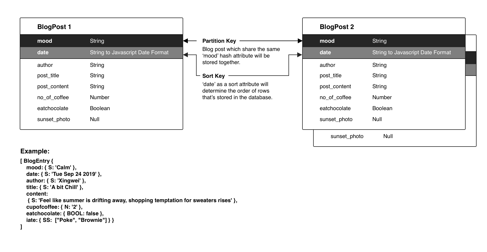
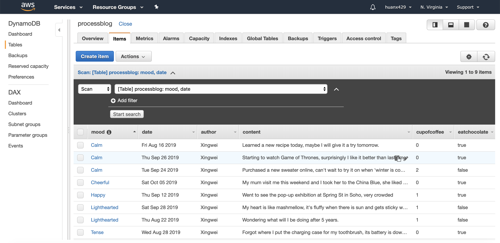
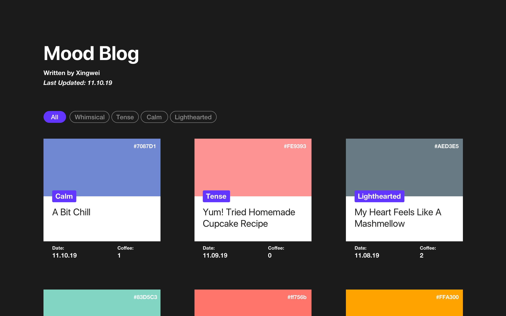
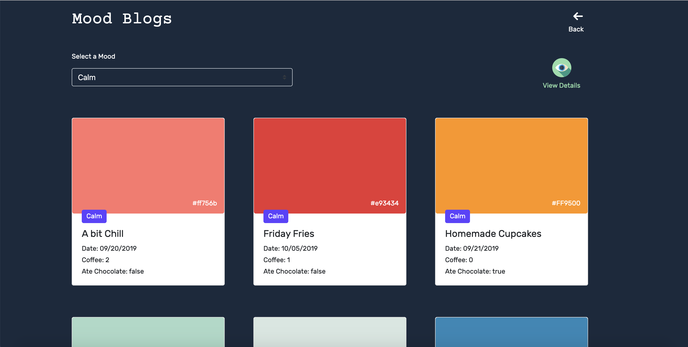

## Final Assignment 2 ( Process Blog )
This process blog is a collection of my Mood Entries through September to October. It aggregates the process and results in weekly assignment [5](https://github.com/Xingwei726/data-structures/tree/master/week5) , [6](https://github.com/Xingwei726/data-structures/tree/master/week6) and [11](https://github.com/Xingwei726/data-structures/tree/master/week11).

## Working Process

**Part One: Collecting Data**

- For this project I choose to use denormalized data because it's blog posts so redundancy doesn't matter in this case. 
- After I did some research, I decided to use **a composite partition-sort key** where I can hold the partition key element constant, and search across the sort key element to retrieve items. Such searching would allow me to use the Query API to, for example, retrieve all items for the same 'mood' across a range of time stamps.



 - I referenced on the [DynamoDB class](https://docs.aws.amazon.com/AWSJavaScriptSDK/latest/AWS/DynamoDB.html) for information about the [PutItem method](https://docs.aws.amazon.com/AWSJavaScriptSDK/latest/AWS/DynamoDB.html#putItem-property) and data types.  The following starter code creates several "Items" destined for DynamoDB, storing them in an array named `blogEntries`:
 - **Partition Key** : mood  
   **Sort Key** : date _(Enrtry Date)_

```javascript
var blogEntries = [];

class BlogEntry {
  constructor(patitionKey, sortKey, author, title, content, cupofcoffee, eatchocolate, iate, sunsetphoto) {
    this.mood = {};
    this.mood.S = patitionKey;
    this.date = {}; 
    this.date.S = new Date(sortKey).toDateString();
    this.author = {};
    this.author.S = author;
    this.title = {};
    this.title.S = title;
    this.content = {};
    this.content.S = content;
    this.cupofcoffee = {};
    this.cupofcoffee.N = cupofcoffee.toString();
    this.eatchocolate = {};
    this.eatchocolate.BOOL = eatchocolate; 
    if (iate != null) {
      this.iate = {};
      this.iate.SS = iate; 
    }
    // if (sunsetphoto !=null){
    //   this.sunsetphoto ={};
    //   this.sunsetphoto = sunsetphoto;
    // }
  }
}
```
  
 
 
 **Part Two: Database**

 - Using Dynamo DB to store my mood entries, following code enables me
   to loop over all of the items in my array and put multiple items into
   my table at the same time.

```Javascript
function putItems(items){
    var insertedCount = 0;
    return new Promise ((resolve, reject) =>{
        items.forEach(item =>{
            var params ={
              TableName: tableName,
              Item: item
            };
            
            dynamodb.putItem(params, (err,data) =>{
                if(err){
                    reject(err);
                }
                else{
                    if(++insertedCount ==items.length){
                        console.log('Successfully inserted'+items.length + 'items.');
                        resolve();
                    }
                }
            });
        });
    });
}
```



 
  
**Part Three: Visual Design**



 - The landing page for my process blog is a grid view of all blog
   posts, default setting is that all posts are arranged
   chronologically. Users can choose 'mood' filters to view between
   posts that's been stored in my database with different partition key.

 
**Part Four: Query Design**

 - Because the default view is all mood selected and in a chronological
   order, so I will query all the data from the dynamoDB first and sort
   them by time. If user select specific 'mood' (such as 'calm') then
   the query would be:

  

```javascript
function processBlog(mood){
    return new Promise(resolve => {
     
        var output = {};
        output.blogpost = [];
        var patitionKeyy=mood

        var params = {
            TableName : "processblog",
            KeyConditionExpression: "#tp = :patitionKey", // the query expression
            ExpressionAttributeNames: { // name substitution, used for reserved words in DynamoDB
                "#tp" : "mood",
            },
            ExpressionAttributeValues: { // the query values
                ":patitionKey": {S: patitionKeyy},
            }
        };
            
        dynamodb.query(params, function(err, data) {
            if (err) {
                console.error("Unable to query. Error:", JSON.stringify(err, null, 2));
            } else {
                console.log("Query succeeded.");
                    data.Items.forEach(function(item) {
                        console.log("***** ***** ***** ***** ***** \n", item);
                        output.blogpost.push({'title':item.title.S, 'mood':item.mood.S,'date':moment(item.date.S).format("L"),'color':item.color.S,'coffee':item.cupofcoffee.N,'ateChocolate':item.eatchocolate.BOOL,'content':item.content.S});
                    });
                    fs.readFile('pbhandle.html', 'utf8', (error, data) => {
                        console.log(data)
                        var template = handlebars.compile(data);
                        var html = template(output);
                        resolve(html);
                    });
            }
        });
    });
 }

```


**Part Five: Font-end Connection**

 - As I was implementing the design, I realized that each mood entry
   isn't that long so I changed the structure from opening up a new page
   to expand the entry card using following code:

```javascript
    for (i = 0; i < coll.length; i++) {
      coll[i].addEventListener("click", function() {
        this.classList.toggle("active");
        var content = this.nextElementSibling;
        if (content.style.display === "block") {
          content.style.display = "none";
        } else {
          content.style.display = "block";
        }
      });
    }
```

And then use a separate CSS file to style the texts. For more information please visit [here](https://github.com/Xingwei726/data-structures/tree/master/Final).


**Part Six: Final Product**

**Link to the app:** http://3.85.39.185:8080

