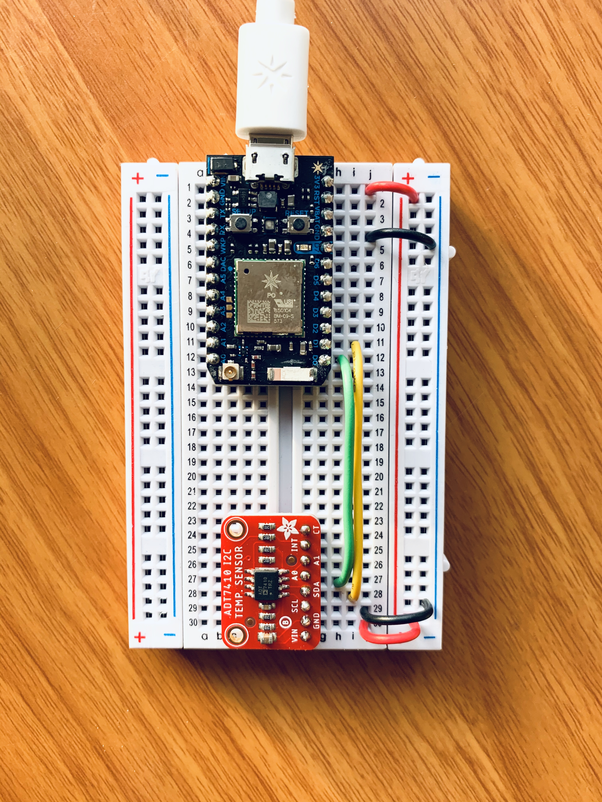
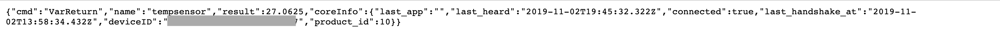
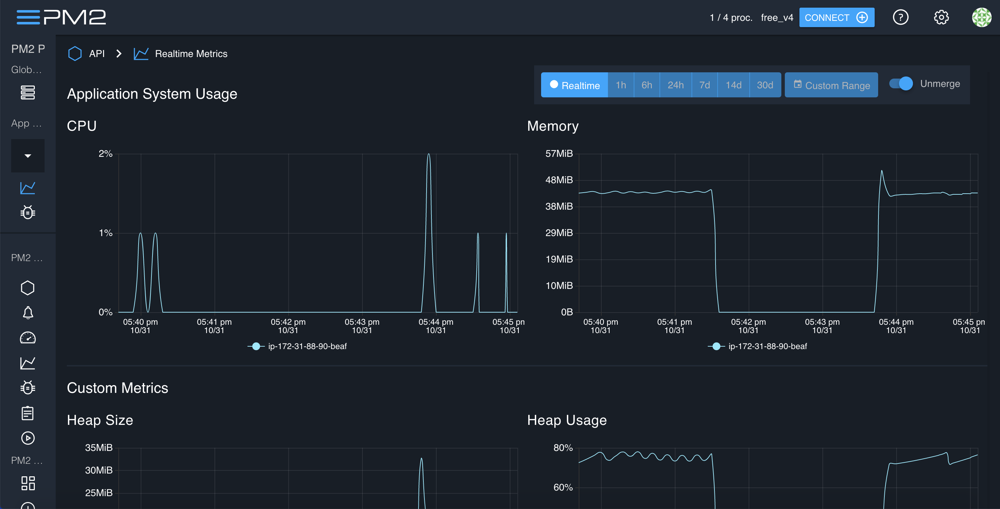
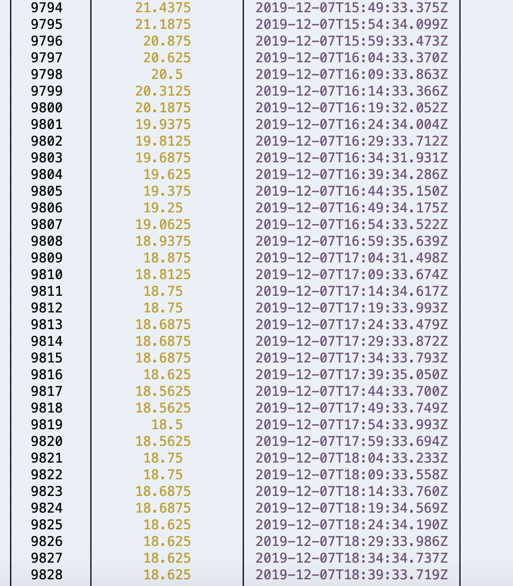
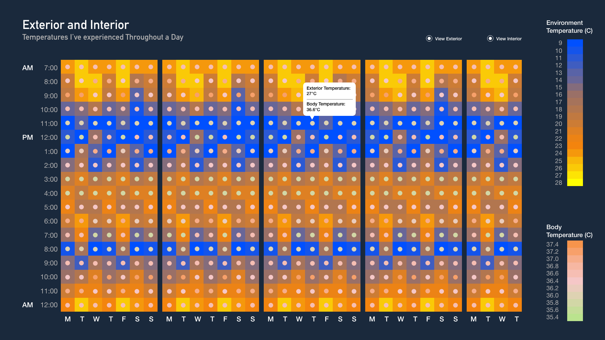
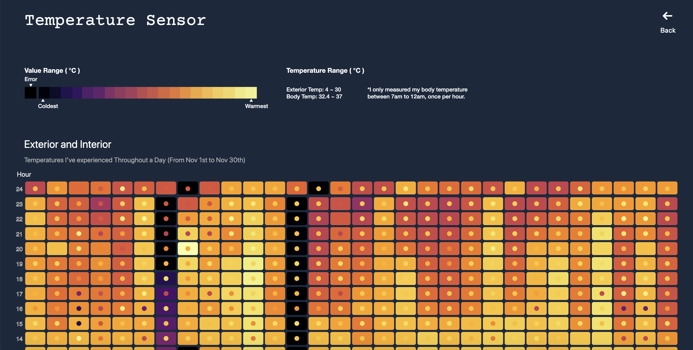

## Final Assignment 3 ( Sensor Data )
Human body temperature is not consistent throughout the day, normally fluctuates over the day following Circadian rhythms, with the lowest levels around 4 a.m. and the highest in the late afternoon. By measuring the temperature of my surroundings (exterior) and my body temperature (interior). I'm curious about what temperatures have I experienced in a day? And how do outside temperatures affect my core body temperature? Is there a correlated relationship/ pattern between them or none?

This project aggregates weekly assignment [8](https://github.com/Xingwei726/data-structures/tree/master/week8) and [9](https://github.com/Xingwei726/data-structures/tree/master/week9). Environmental temperature data was collected through Particle [Electron](https://docs.particle.io/electron/) and body temperature data was measured through a thermometer.

## Working Process

**Part One: Collecting Data**

 - Set up the temperature sensor and make appropriate connections to the
   Particle Electron,  code below was used in the [Web
   IDE](https://build.particle.io/) for collecting the sensor value.



```javascript
void setup()
{
tempsensor.begin();
// sensor takes 250 ms to get first readings
delay(500);
Particle.variable("tempsensor", &tempvalue, DOUBLE);
}

void loop()
{
// Read and print out the temperature, then convert to *F
float c = tempsensor.readTempC();
float f = (c * 9 / 5) + 32;
tempvalue = f;
delay(500);
}

```

 - On the other hand, I decided to use a less 'advanced' tool---a thermometer--- to help me measure my core body temperature . It's an instant accurate reading thermometer which automatically save the last 35 readings and store them. It came with four modes: measure the temperature of ear, forehead, object surface and room. So I will measure my core body temperature once every hour.

 
 
 **Part Two: Database**

 - Because the dataset I will be using to design my temperature data
   visualization are pairs of external temperature and internal body
   temperature along one month timeline. The database itself doesn't
   have to be horizontally scalable as well as the data types can be
   fixed at this early stage so I chose to set up a PostgreSQL using the
   following javascript:
```javascript
const { Client } = require('pg');
const dotenv = require('dotenv');
dotenv.config({path: '/home/ec2-user/environment/week9/.env'});
const db_credentials = new Object({
   user: "huanx429",
   password: process.env.AWSRDS_PW,
   host: process.env.AWSRDS_EP,
   database: "aa",
   port: 5432,
});

// Connect to the AWS RDS Postgres database
const client = new Client(db_credentials);
client.connect();

var thisQuery = "CREATE TABLE sensorData ( sensorValue double precision, sensorTemp timestamp DEFAULT current_timestamp );";

client.query(thisQuery, (err, res) => {
    console.log(err, res);
    client.end();
});

```

 - Connected my electron with Web IDE, I tested it in the web server to
   see if it's actually working.



 - After I made sure everything is set up and ready to go, in AWS I
   created a script file with the starter code, using following function
   to query temperature value and insert the values to the PostgreSQL
   database.

```javascript
var getAndWriteData = function() {
    
    // Make request to the Particle API to get sensor values
    request(device_url, function(error, response, body) {
        
        // Store sensor value(s) in a variable
        var sv = JSON.parse(body).result;
        
        const client = new Client(db_credentials);
        client.connect();
        var thisQuery = "INSERT INTO sensorData VALUES (" + sv + ", DEFAULT);";
        console.log(thisQuery); // for debugging

        // Connect to the AWS RDS Postgres database and insert a new row of sensor values
        client.query(thisQuery, (err, res) => {
            console.log(err, res);
            client.end();
        });
    });
};
```

 - Then I changed the default setting in Cloud9 to specify that I would
   like my server to run continuously.  Installed [PM2
   Runtime](https://pm2.keymetrics.io/docs/usage/pm2-doc-single-page/)
   so it will help me to run the query code every 5 minutes. They also
   have a web-based dashboard where you can monitor all activities.





 - *For more details please visit [here](https://github.com/Xingwei726/data-structures/blob/master/week9/README.md)*


 
  
**Part Three: Visual Design**


On the homepage I'm presenting two dataset. Because the default view presents all the data at once so the first step would be to query all the data based on the final timepoints I've selected. Each square is tied to a timestamp, it has one related value that come from each table. Whenever your mouse hover, a tooltip states the exact value of that 'box'.

**Assumptions**  

Based on the data I've collected so far, the relationship between exterior and interior temperatures is statistically significant and it's a positive relationship which means when exterior temperature drops my core body temperature drops as well. The direction of changes are the same. However the relationship itself is very weak. The degree of exterior temperature changes didn't cause same amount of change to my core body temperature. My core body temperature has been retained within a range from 35.8~36.6 (there were some outliers at 32)

Also I noticed that there might be other factors that may alter my body temperature as well such as food digestion, shower and exercises.
  
 
**Part Four: Query Design**

In the query I extracted the day and hour data from the default timestamp format, and then use AVG to get average temperature value from each time interval. 

```javascript
        var thisQuery = `SELECT 
        EXTRACT(DAY FROM sensortemp) as sensorday,
        EXTRACT(HOUR FROM sensortemp) as sensorhour,
        AVG(sensorvalue::int) as AVGTEMP
        FROM sensorData
        GROUP BY sensorday,sensorhour
        ORDER BY sensorday
        ;`;
        
        
        client.query(thisQuery, async(err, res) => {
            if (err) {
                console.log(err);
            } else {
                resolve(res.rows);
            }
        });

```


**Part Five: Font-end Connection**

```javascript
function getResults(value){
    var parameters = { period: value };
    $.get( '/temp',parameters, function(d) {
        $('#tempreadings').html(d)
        rawdata=d;
        data=d;
        raw=d;

        for (i = 0; i < d.length; i++) {        
           sensorday.push(d[i].sensorday);
           sensorhour.push(d[i].sensorhour);
           sensortemp.push(d[i].avgtemp);
        }

        square();
        circle();
    });
}

```

Use d3 to create the 'heat-map' based on the data returned. 

```javascript
svg.selectAll('rect')
    // .data([data])
    .data(data)
    .enter()
    .append("rect")
      .attr("x", function(d){
          return x(d.sensorday)
      })
      .attr("y", function(d){
          return y(d.sensorhour)
      })
      .attr("rx", 4)
      .attr("ry", 4)
      .attr("width", 42)
      .attr("height", 27)
      .style("fill",function(d){
          return myColor(d.avgtemp)
      })
      .style("stroke-width", 4)
      .style("stroke", "none")
      .style("opacity", 1)
    .on("mouseover", mouseover)
    .on("mousemove", mousemove)
    .on("mouseleave", mouseleave)

```

And then use a separate CSS file to style the texts. For more information please visit [here](https://github.com/Xingwei726/data-structures/tree/master/Final).


**Part Six: Final Product**

**Link to the app:** http://3.85.39.185:8080