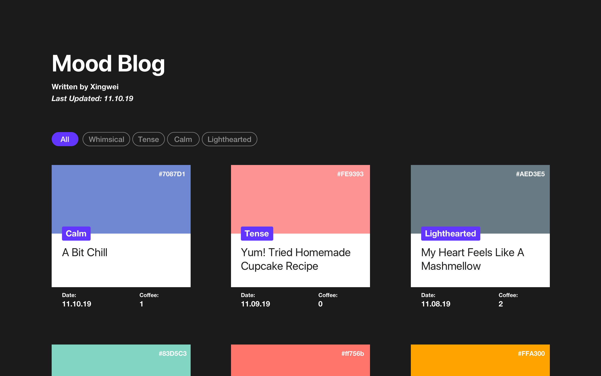
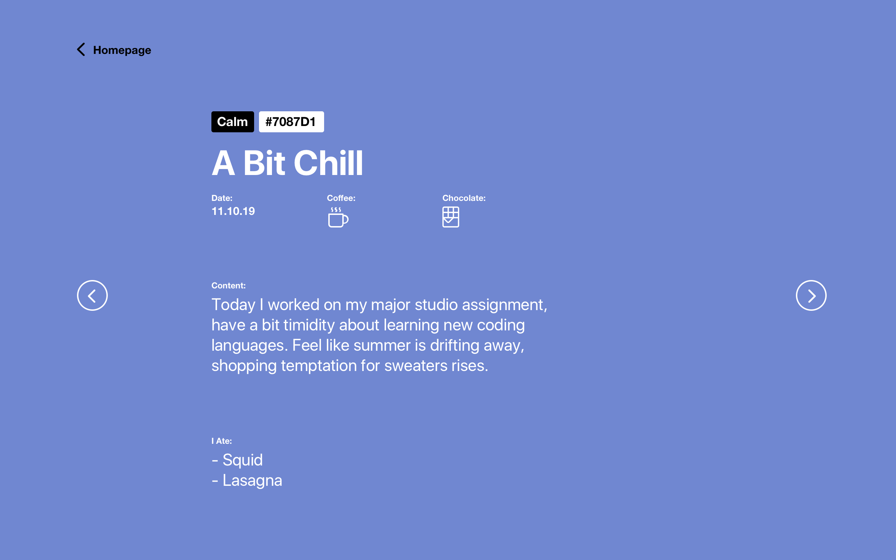
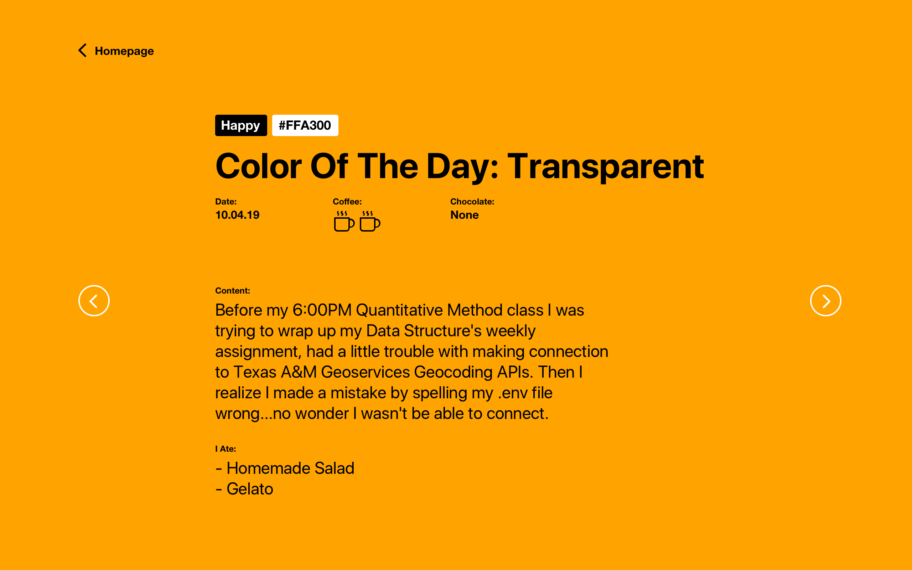
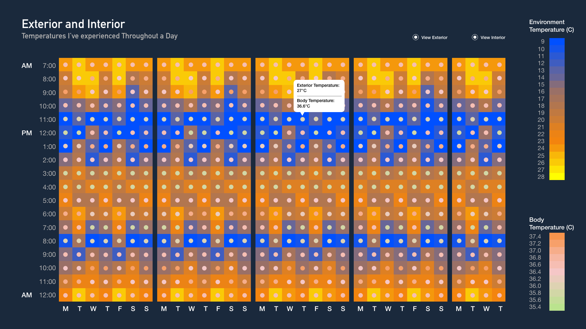
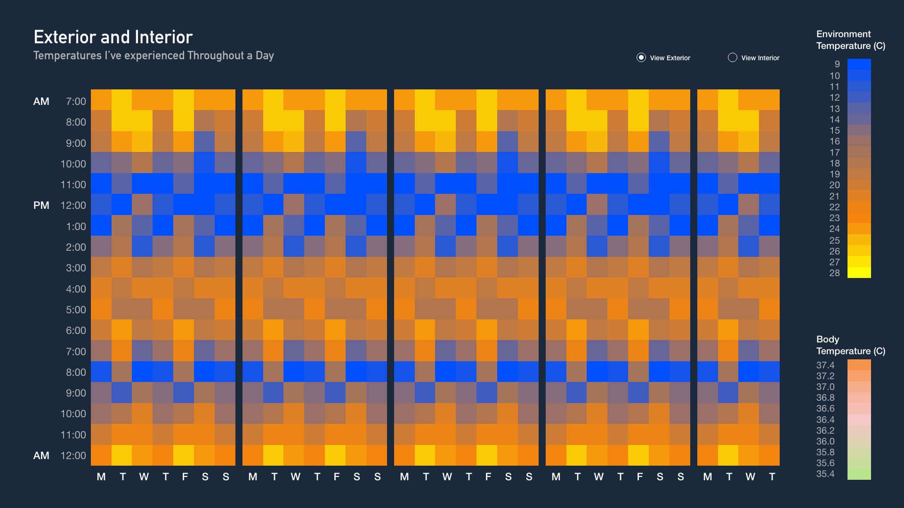
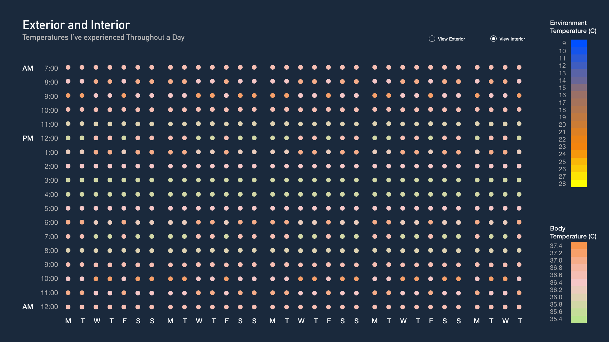
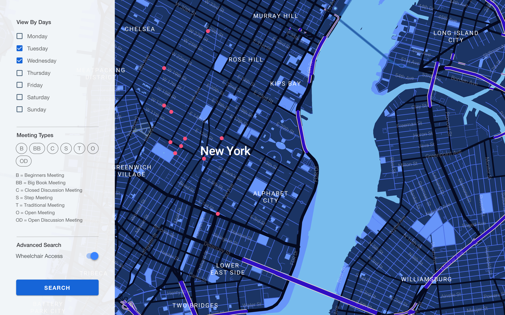
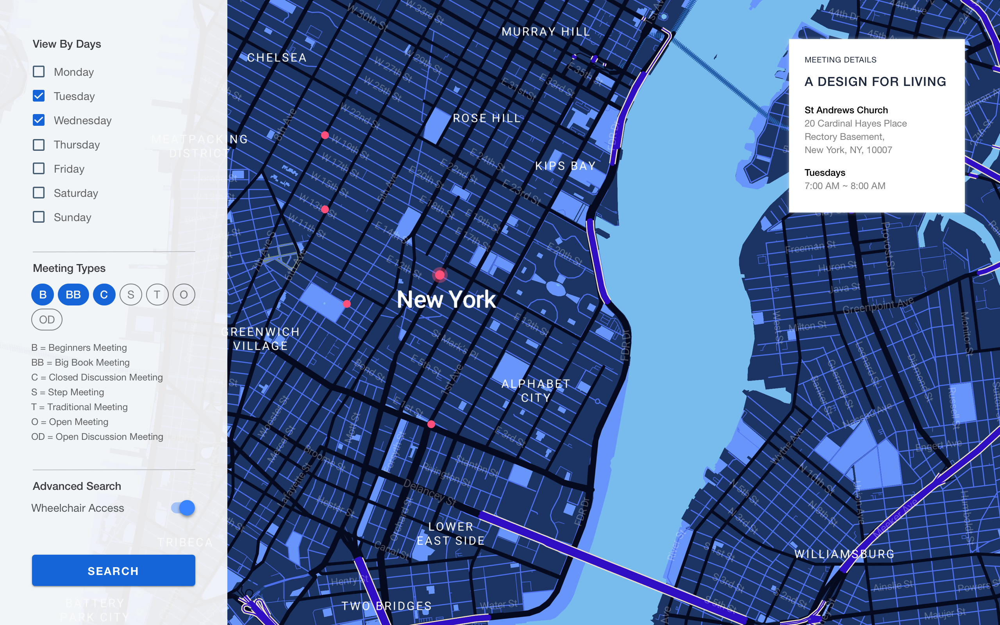

# Weekly Assignment 11

## Assignment Description
This weekly assignment is to design three interfaces for my three data sources (AA meetings, process blog, and sensor's data). Not only think about visual design and functionality but also consider how to connect data with front-end interfaces as well as data mapping.


## A. Process Blog

**/ 1.1 Default View (Grid)**


The landing page for my process blog is a grid view of all blog posts, default setting is that all posts are arranged chronologically. Users can choose 'mood' filters to view between posts that's been stored in my database with different partition key.

**Data Structure:** 

Because the default view is all mood selected and in a chronological order, so I will query all the data from the dynamoDB first and sort them by time. If user select specific 'mood' (such as 'calm') then the query would be: 

```javascript
   var params = {
        TableName : "processblog",
        KeyConditionExpression: "#tp = :patitionKey",
        ExpressionAttributeNames: {
            "#tp" : "mood",
        },
        ExpressionAttributeValues: {
            ":patitionKey": {S: "Calm"},
        }
    };
```
On this page data I will present are:  
 - partition key (mood)  
 - sort key (timestamp)
 - title
 - color os the day
 - cups of coffee


**/ 1.2 Default View (List)**


Users can toggle between grid view or list view, while grid view gives a spread-out idea, list view is a summarized visualization of all the process blog data. 

**Data Structure:** 

The data structure here is the same with previous view, just the visualization form is different.


**/ 1.3 Blog Details Page**




Once user click on a blog post on the homepage, it will redirect them to a new page that shows all the information inside this blog post. The background color is tied to the RGB value of 'color of the day' in the database. They can either click on "homepage" and go back to the landing page, or click on arrow icons to view previous or next blog post.


**Data Structure:**

On the previous homepage, once user select a specific post, it will make a query to the database based on the partition key and sort key that's been selected and return the post details that fit both keys (there is only one post per day therefore date won't overlap)


## B. Sensor Data

**/ 1.1 Homepage**


Human body temperature is not consistent throughout the day, normally fluctuates over the day following Circadian rhythms, with the lowest levels around 4 a.m. and the highest in the late afternoon. By measuring the temperature of my surroundings (exterior) and my body temperature (interior). I'm curious about what temperatures have I experienced in a day? And how do outside temperatures affect my core body temperature? Is there a correlated relationship/ pattern between them or none?

On the homepage I'm presenting two 'layers' of data, the default view is two layers are both selected. User can select and unselect one or another to view single dataset only. 

**Data Structure:**
Because the default view presents all the data at once so the first step would be to query all the data from both tables ( exterior & interior temperatures) based on the final timepoints I've selected.

Each square is tied to a timestamp, it has one related value that come from each table. If user click on the radio button to filter then only one dataset would be presented, users can't unselect both buttons (because then the homepage would be empty).

Whenever your mouse hover, a tooltip states the exact value of that 'box'.


**/ 1.2 Filtered View**


User may click on the radio button to filter then only one dataset would be presented.




**/ 1.3 Assumptions**
Based on the data I've collected so far, the relationship between exterior and interior temperatures is statistically significant and it's a positive relationship which means when exterior temperature drops my core body temperature drops as well. The direction of changes are the same. However the relationship itself is very weak. The degree of exterior temperature changes didn't cause same amount of change to my core body temperature. My core body temperature has been retained within a range from 35.8~36.6. 

Also I noticed that there might be other factors that may alter my body temperature as well such as food digestion, shower and exercises.

## C. AA Meetings

**/ 1.1 Homepage**


(I tried the map-box online, the map in this mockup design is made by using map-box.)
The landing page for my AA meetings is a map view of all blog meetings, default setting is that all meeting are marked with a dot on the map. And there is a filter dashboard on the let hand side. 
Two main filters I considered to use here are by 'Day of the Week' and "Meeting Type' because I thought about my users might want to find a meeting that fit his / her needs, for example he or she might want to locate a Tuesday meeting that's open for beginners, then all they need to do is to select 'Tuesday' under the day filter and select 'B' in meeting type list. Then dots on the map will be filtered based on the selections.

**Data Structure:**
When users land on the homepage, it will make a query to the database of all AA meetings, but only return with location information (no meetings details required at this point). Then after users make filter decisions, it will make a query that based on the filters and return will all the location & meeting information that fit to the keys.

**/ 1.2 Selected Filter**

Whenever user hovers over a location dot, it will show the meeting details in a tooltip box on the right hand side. Sometimes one location has many meetings which fit into the requirement, but very often there is only one meeting.


## Thoughts

Through both week10 and week11 assignments, I have a better idea about how I want to present each type of data as well as how to query them from the stored database. As I was designing prototypes for each final assignment, I also made changes about previous database decisions. However since I had no experience in front-end design, I'm still a bit confused about how to connect visuals to the data points, this week I will do more research which relate with that.