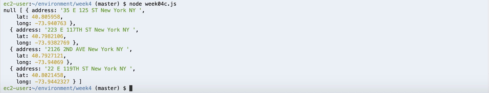

## Assignment Description
Continue working with the data we've parsed, and augmented in the previous three assignments. In this assignment, we will write our AA data to a relational database.

## Working Process
**Part One: Plan**

- Normalized data may cause queries to slow down but I will use a normalized data model because data redundancy costs extra trouble in terms of maintaining the database, so in my plan each entity has its own table.
- When data come out of data base it will be organized in an JSON object structure. The hierarchy depends on users’ queries. If they want to search for groups, then groups’ info will be placed on top level with other foreign keys which give access to other data tables such as meetings ( all meetings this group has) and locations (all location associated with this group) etc.

I chose the ER modeling language to create data model for AA meetings’ data because it’s universally used to represent relationships between different entities. I categorized data attributes into four entities (buckets) : location/group/meeting/time.


**Part Two: Create a table(s) in the database**

Modify the starter code to create tables in my data base, since I don't have all necessary information parsed out yet, in `week04a`  I just replaced the database credentials with my own, hide key using .env file. 
```javascript
var db_credentials = new Object();
db_credentials.user = 'huanx429';
db_credentials.host = 'database-structures.c9iddlpctkv6.us-east-1.rds.amazonaws.com';
db_credentials.database = 'aa';
db_credentials.password = process.env.AWSRDS_PW;
db_credentials.port = 5432;

// Connect to the AWS RDS Postgres database (not gonna change)
const client = new Client(db_credentials);
client.connect();
var thisQuery = "CREATE TABLE aalocations (address varchar(100), lat double precision, long double precision);";
```
  
  
**Part Three: Populate the database**

Use the [pg module](https://node-postgres.com/) in Node to insert my AA data in the database I created. 
```Javascript
var rawAddresses = fs.readFileSync('../week4/first.json');
var addressesForDb = JSON.parse(rawAddresses);

async.eachSeries(addressesForDb, function(value, callback) {
    const client = new Client(db_credentials);
    client.connect();
    var thisQuery = "INSERT INTO aalocations VALUES (E'" + value.address + "', " + value.lat + ", " + value.lng + ");";
    client.query(thisQuery, (err, res) => {
        console.log(err, res);
        client.end();
    });
    setTimeout(callback, 1000); 
}); 
```
  
**Part Four: Check Database Table**

Use the starter code to query all of the contents in my database right now to check.


## Conclusions:

As I was planning the database model, I wondered if I should put time information into its own table or not. Reason why I did this is because then users can search time / group / location and get meeting information related with each unique key. But I'm not sure creating this extra table would or would not complex the query?