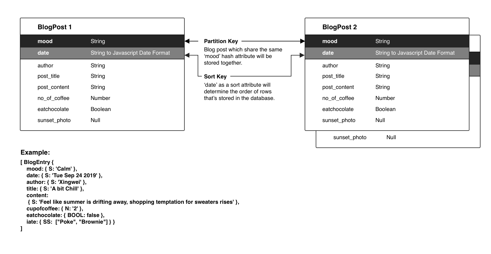
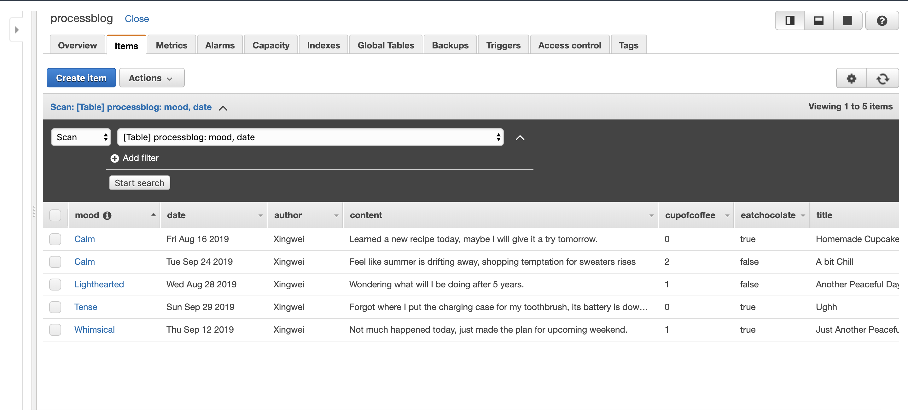
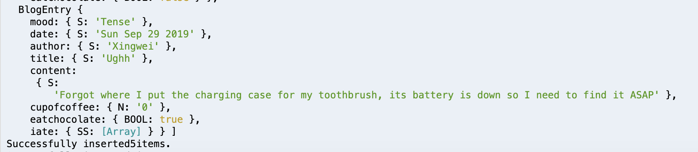

## Assignment Description
Using Amazon Web Services to create a table in Amazon DynamoDB, a NoSQL database service and start to work with data for the "Process Blog" project (the data source for Final Assignment 2).


## Working Process
**Part One: Plan**

- For this project I choose to use denormalized data because it's blog posts so redundancy doesn't matter in this case. 
- After I did some research, I decided to use **a composite partition-sort key** where I can hold the partition key element constant, and search across the sort key element to retrieve items. Such searching would allow me to use the Query API to, for example, retrieve all items for the same 'mood' across a range of time stamps.
- I designate the date types for each attribute based on this [Naming Rules & Data Types References](https://docs.aws.amazon.com/amazondynamodb/latest/developerguide/HowItWorks.NamingRulesDataTypes.html)




**Part Two: Create some data for the table in your database**

I referenced on the [DynamoDB class](https://docs.aws.amazon.com/AWSJavaScriptSDK/latest/AWS/DynamoDB.html) for information about the [PutItem method](https://docs.aws.amazon.com/AWSJavaScriptSDK/latest/AWS/DynamoDB.html#putItem-property) and data types.  The following starter code creates several "Items" destined for DynamoDB, storing them in an array named `blogEntries`:
**Partition Key** : mood  
**Sort Key** : date _(Enrtry Date)_

```javascript
var blogEntries = [];

class BlogEntry {
  constructor(patitionKey, sortKey, author, title, content, cupofcoffee, eatchocolate, iate, sunsetphoto) {
    this.mood = {};
    this.mood.S = patitionKey;
    this.date = {}; 
    this.date.S = new Date(sortKey).toDateString();
    this.author = {};
    this.author.S = author;
    this.title = {};
    this.title.S = title;
    this.content = {};
    this.content.S = content;
    this.cupofcoffee = {};
    this.cupofcoffee.N = cupofcoffee.toString();
    this.eatchocolate = {};
    this.eatchocolate.BOOL = eatchocolate; 
    if (iate != null) {
      this.iate = {};
      this.iate.SS = iate; 
    }
    // if (sunsetphoto !=null){
    //   this.sunsetphoto ={};
    //   this.sunsetphoto = sunsetphoto;
    // }
  }
}
blogEntries.push(new BlogEntry('Whimsical','Sep 12 2019', "Xingwei", "Just Another Peaceful Day", "Not much happened today, just made the plan for upcoming weekend.", 1, true, ["Poke", "Brownie"]));
blogEntries.push(new BlogEntry('Calm','Sep 24 2019', "Xingwei", "A bit Chill", "Feel like summer is drifting away, shopping temptation for sweaters rises", 2,false, ["Green Salads", "Meatballs"]));
blogEntries.push(new BlogEntry('Calm','Aug 16 2019', "Xingwei", "Homemade Cupcakes", "Learned a new recipe today, maybe I will give it a try tomorrow.", 0, true, ["Homemade Cupcakes"]));
blogEntries.push(new BlogEntry('Lighthearted','Aug 28 2019', "Xingwei", "Another Peaceful Day", "Wondering what will I be doing after 5 years.", 1, false));
blogEntries.push(new BlogEntry('Tense','Sep 29 2019', "Xingwei", "Ughh", "Forgot where I put the charging case for my toothbrush, its battery is down so I need to find it ASAP", 0, true, ["lasagna", "Squid"]));
```
  
  
**Part Three: Populate the database**

Use the AWS SDK for JavaScript to work with my DynamoDB table in Node.js. Install with:  `npm install aws-sdk`
I modified the starter code so I can loop over all of the items in my array and put  multiple items into my table at the same time.

```Javascript
var AWS = require('aws-sdk');
AWS.config = new AWS.Config();
AWS.config.region = "us-east-1";

var dynamodb = new AWS.DynamoDB();
var tableName = "processblog";
putItems(blogEntries)
.then(() => {
    return putItems(blogEntries);
})
.catch((err) => {
    console.error('Insert failed', err);
});

function putItems(items){
    var insertedCount = 0;
    return new Promise ((resolve, reject) =>{
        items.forEach(item =>{
            var params ={
              TableName: tableName,
              Item: item
            };
            
            dynamodb.putItem(params, (err,data) =>{
                if(err){
                    reject(err);
                }
                else{
                    if(++insertedCount ==items.length){
                        console.log('Successfully inserted'+items.length + 'items.');
                        resolve();
                    }
                }
            });
        });
    });
}
```
  
**Part Four: Check Database Table**
Checked my table in the AWS Console and make sure my items were successfully put into the table.



(PS: When I loop over all items in the last step, if it was successful I would see a message in my console as well to double make sure.)



## Conclusions:

In my data model plan I was wondering if it was possible to put images into DynamoDB tables, I searched online and people say I could have an IMAGES table where you store items with an image Binary attribute value, however I don't know how to achieve that yet.