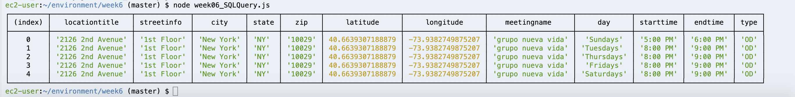
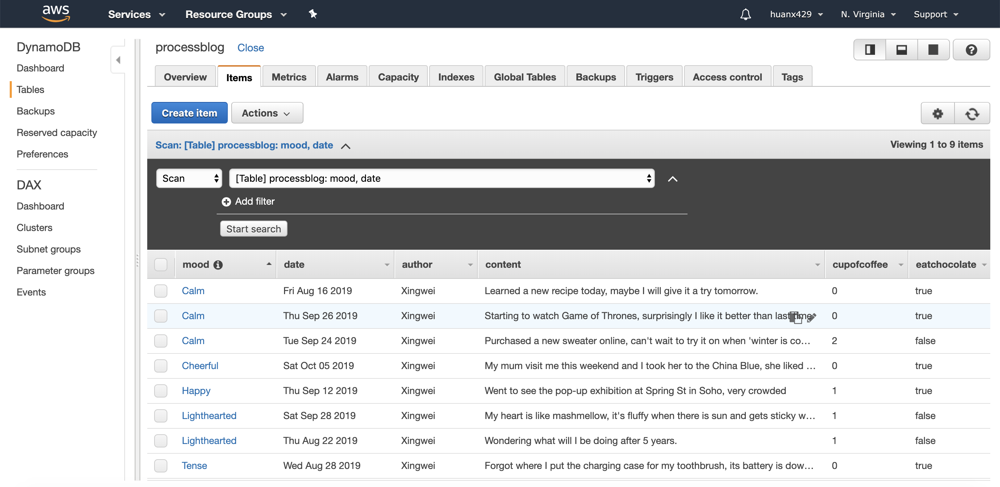
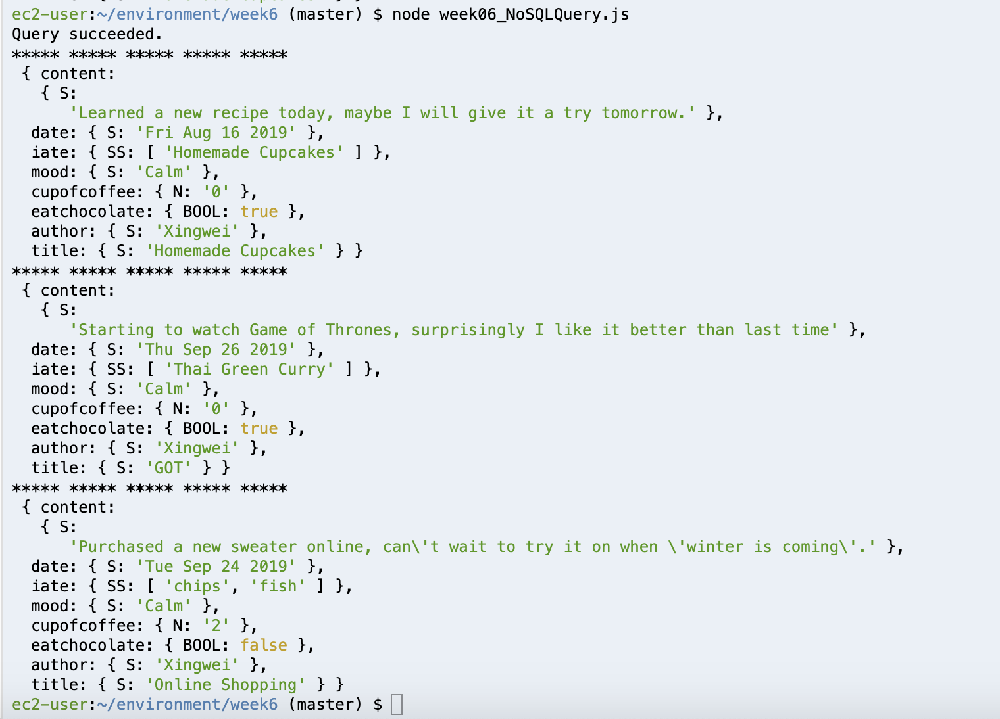
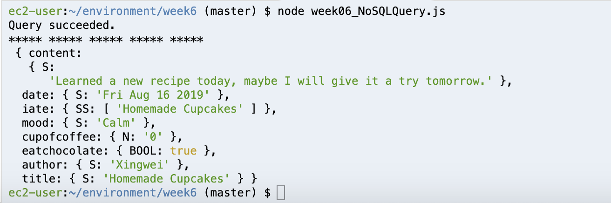

# Weekly Assignment 6

### Assignment Description
In this weekly assignment I added more AA meeting information in my PostgreSQL database and the Process Blog data in DynamoDB. I wrote and executed a query to retrieve data from each one of them. 

## PostgreSQL

**PART ONE: Create PostgreSQL Table**

Since I added more [data](https://github.com/Xingwei726/data-structures/blob/master/week3/data/AA09.csv) that I've parsed from zone 9, I recreated a PostgreSQL Table `aalocations` with following code, for more information please visit [here](https://github.com/Xingwei726/data-structures/blob/master/week4/week04_createTable.js).
```javascript
var thisQuery = `CREATE TABLE aalocations (
                                          locationTitle varchar(200),
                                          streetInfo varchar(200),
                                          city varchar(25),
                                          state varchar(25),
                                          zip varchar(25),
                                          details varchar(200),
                                          latitude double precision,
                                          longitude double precision,
                                          meetingName varchar(200), 
                                          day VARCHAR(10),
                                          startTime VARCHAR(20),
                                          endTime VARCHAR(20),
                                          type VARCHAR(10));`;
```
**PART TWO: Insert Values**

Using the [`pg`](https://node-postgres.com/) in Node to insert my AA data in the database. Modified the following starter code and using the following code to insert data into my PostgreSQL table :
```javascript
var thisQuery = "INSERT INTO aalocations VALUES (E'" + value.locationTitle + "','" + value.streetInfo + "', '" + value.city + "', '" + value.state + "', '"+ value.zip + "', '" + value.details + "', '" + value.latitude + "', '"+value.longitude + "', '" + value.meetingName + "', '" + value.day + "', '" + value.startTime + "', '" + value.endTime + "', '" + value.type + "');";
```
For more information please visit [here](https://github.com/Xingwei726/data-structures/blob/master/week4/week04_insertData.js).

**PART THREE: Check Results**

In order to check results, I made a query about all meetings in zone 9 with the meeting type of OD.

*expect no. of return result is: 5*

```Javascript
var thisQuery = "SELECT locationTitle, streetInfo, city, state, zip, latitude, longitude, meetingName, day, startTime, endTime, type FROM aalocations WHERE type ='OD';";
```
Result of the query:


## DynamoDB
**PART ONE: Create Table & Insert Data**

I'm using the same table I've created in [week5](https://github.com/Xingwei726/data-structures/blob/master/week5/week05.js), but populate it with more blog entries in order to test the query.


**PART TWO: Qurey Tests**
**Query Test 1:**

Retrieve all blog entries that's under the **mood** 'calm', using following code: 

*expect no. of return result is: 3*
```javascript
var params = {
    TableName : "processblog",
    KeyConditionExpression: "#tp = :patitionKey", // the query expression
    ExpressionAttributeNames: { // name substitution, used for reserved words in DynamoDB
        "#tp" : "mood",
    },
    ExpressionAttributeValues: { // the query values
        ":patitionKey": {S: "Calm"},
    }
};
```
Result of the query:


**Query Test 2:**

Retrieve all blog entries that's under the **mood** 'calm' and on **date** 'Aug 16 2019' using following code: 
*expect no. of return result is: 1*
```javascript
var params = {
    TableName : "processblog",
    KeyConditionExpression: "#tp = :patitionKey AND #dt =:sortKey", // the query expression
    ExpressionAttributeNames: { // name substitution, used for reserved words in DynamoDB
        "#tp" : "mood",
        "#dt" : "date"
    },
    ExpressionAttributeValues: { // the query values
        ":patitionKey": {S: "Calm"},
        ":sortKey" : {S: new Date("Aug 16 2019").toDateString()},
    }
};
```
Result of the query:
