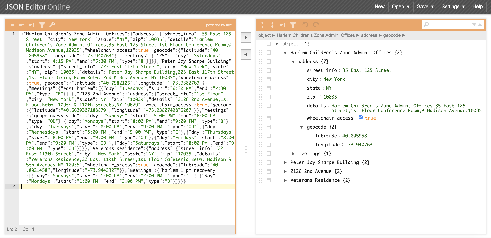
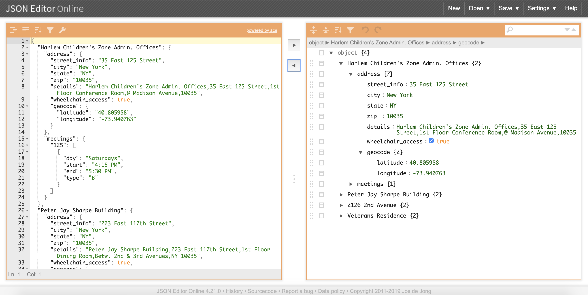
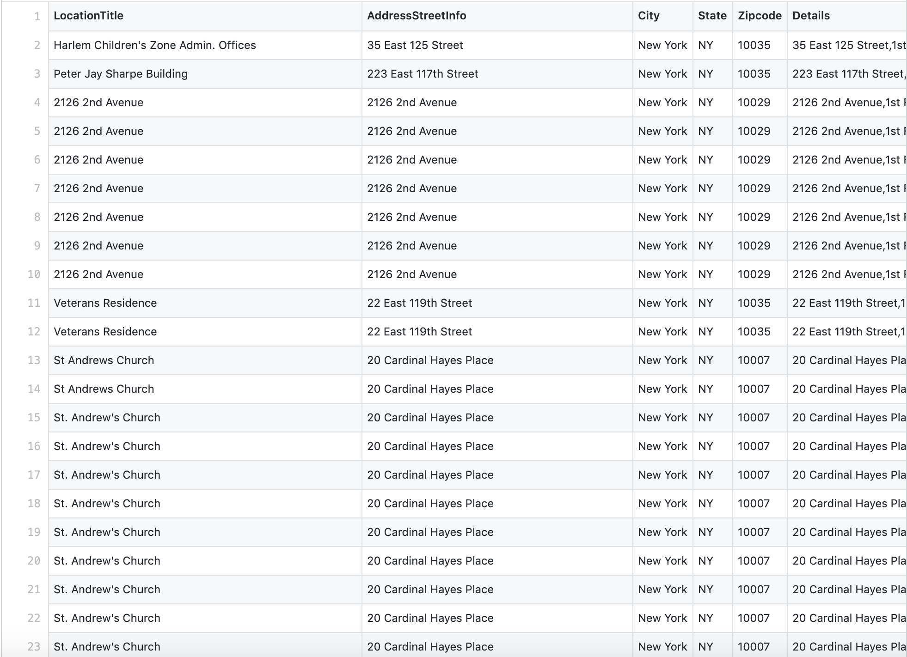
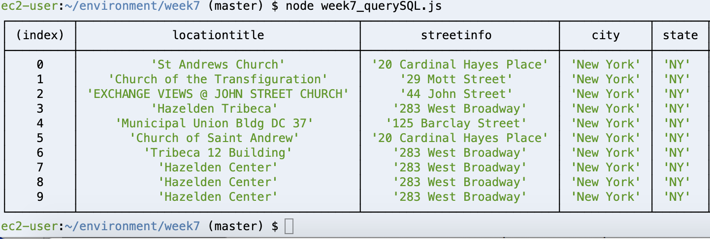
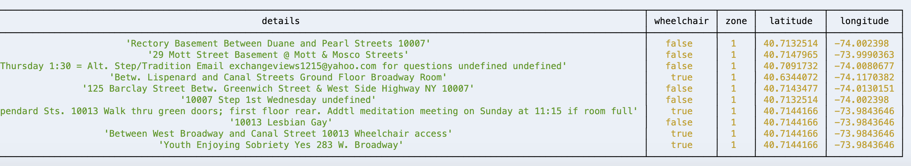

# Weekly Assignment 7

## Assignment Description

Finish parsing and cleaning the rest of the data in my assigned "zone 9" and all other zones, and update/replace my PostgreSQL table(s) with the new data. 

## Parse All Data
**Step 1 Reexamine txt file's Structure**
In Week2 assignment, I used following code to target on the address details:
```javascript
$('td').each(function(i, ele) {
    if($(ele).attr("style")==='border-bottom:1px solid #e3e3e3; width:260px'){
        meetingAddress+=$(ele).text().trim('')+"\n"
    };
});
```
It worked in previous scenario when I was trying to target on that only element, but it won't work for parsing out all the information. Therefore I reexamined the structure and found out that each location object is wrapped by a `<tr>` tag nested inside another two `<tr>` tag , and inside each location object, address details is wrapper by a pair of  `<td>` tag as well as the meetings information ( which is wrapped by another pair of  `<td>` tags). So I use the following code to target on that:
```javascript
$('tr tr tr').each(function (i, elem) {
  //location + meeting information
}
```

**Step 2 Define and Parse Out Each Element** 
This returns all text element inside `'tr tr tr'`, my logic was that: 
find first `<td>`tag inside the text element--->it contains four lines of texts ( eg. "Harlem Children's Zone Admin. Offices", "125 - TWO FOR ONE -", "35 East 125 Street, 1st Floor Conference Room" , "(@ Madison Avenue) 10035")--->then using regular expressions and `.split` to split a string into an array of substrings---then use `.filter(Boolean)` to remove values which are "falsey", like empty strings or null--->the first element in the result array is location name ( eg. "Harlem Children's Zone Admin. Offices")

```javascript
// LOCATION DETAILS
var location = $(elem).find('td').eq(0).text().split(/\n|,|\(|\)|-/).map(item => item.trim()).filter(Boolean);
// LOCATION NAMES
var locationName = location[0];
``` 

Same with zipcode, it's nested inside the first `<td>` tags, then I used `.split('<br>')` to break the string whenever there is a `<br>` tag, it's after 3rd `<br>` so I used `[3]` to target on it, after trim all white space, last 5 characters is zipcode.

```javascript
// ZIPCODE
var zipcode = $(elem).html().split('<br>')[3].trim().slice(-5);
``` 
For wheelchair access information I used

```javascript
// WHEELCHAIR ACCESS INFORMATION
var wheelchair;
if ($(elem).html().includes('Wheelchair access')) {
    wheelchair = true;
    } else {
    wheelchair = false;
}
```

**Step 3: Clean the Data**
After I parsed out all data, I used `remove()` function to remove all the unnecessary white space or line break that's inside the html structure.
```javascript
//REMOVE REDUNDANT
$(elem).find('div').eq(0).remove();
$(elem).find('b').eq(0).remove();
$(elem).find('span').eq(0).remove();
```

**Step 4: Check the Data** 
Because JSON format is not very human readable especially when I have lots of addresses in one file (on one line) So I've used two methods to check if I get all my data out successfully.

First I pasted the JSON data into this online  [JSON file reader](https://jsoneditoronline.org/), it translates the file structure for me more clearly and then I would be able to see if I parsed the right data or not.



I found it's extremely useful because you can also click on the back arrow it will reformat the JSON file for you so you can see what's missing.



Second method I borrowed Neil's idea to create a CSV file, the tabular format is readable and helps me to go over all the data I got in the end and see what I'm missing.




## Conclusion:

 - Because I spend a great amount of time trying to figure out how to parse the data, I didn't really observe the results yet,  there are some group titles I found "suspicious", so I'm going to compare my data with each zone's txt file to see if I did anything wrong.
 - I'm still trying to figure out the best way to insert the data into my SQL data base

## Followup:
 - After the office hour with Ryan, he has pointed out the problem of my original data structure and suggested me to just save each zone's meeting infomration in a individual file, so I rewrote everything (in this folder file name which starts with 'week7'are new files) and it worked!

