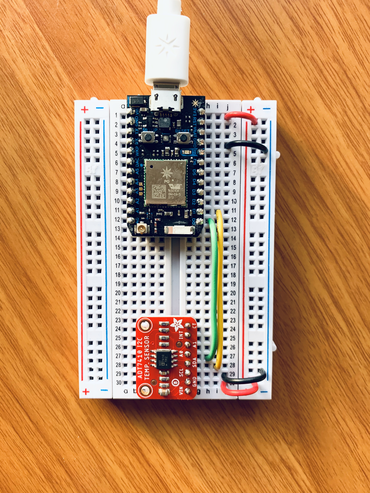
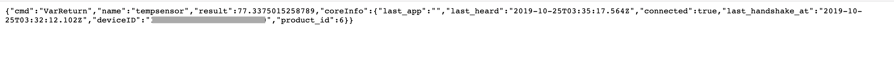
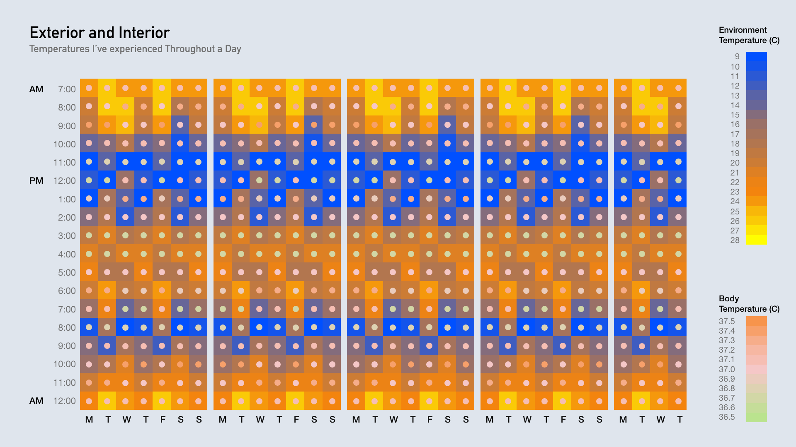

# Weekly Assignment 8

## Assignment Description

Set up the temperature sensor and make appropriate connections to the Photon.
In the  [Web IDE](https://build.particle.io/), copy and modify the  [starter code](https://github.com/visualizedata/data-structures/tree/master/weekly_assignment_08)  for the sensor so that I can access its values.

## Setup Sensor

Photon and temperature sensor we've been supplied in the class.

## Setup Web IDE
After I used starter code files to set up my web IDE, I did a test to see if it's working. Below is a screenshot I got:

## Question and Assumptions
Human body temperature is not consistent throughout the day, normally fluctuates over the day following Circadian rhythms, with the lowest levels around 4 a.m. and the highest in the late afternoon. By measuring the temperature of my surroundings (exterior) and my body temperature (interior). I'm curious about what temperatures have I experienced in a day? And how do outside temperatures affect my core body temperature? Is there a correlated relationship/ pattern between them or none? 

## Idea Sketch
